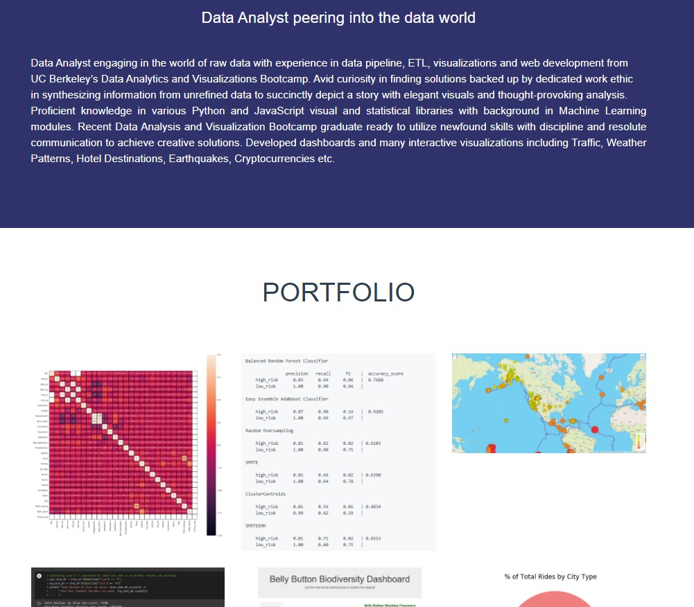

# Professional Portfolio
Simranjot "Sim" Singh's Professional Portfolio. This portfolio highlists the projects I have worked on ever since I participated in the Data Analytics and Visualizations Bootcamp form UC Berkeley Extension. 

I created this portfolio to advance my understanding of professionalism and gain expericence in using HTML-CSS-Javascript as a personal touch. Some of the tools and libraries are:
- Bootstrap Stack
- Custom Fonts
- Popper.js
- jQuery

